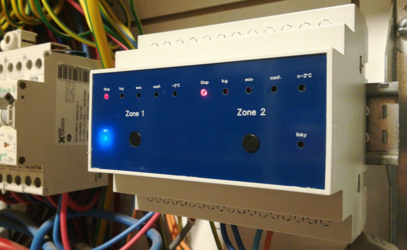

# 2-Zone Heating Controller — ESP32 fil pilote + Linky + MQTT

> [🇫🇷 Français](README.fr.md) | 🇬🇧 English

<p align="center">
  
</p>

## 🛒 Bare PCB available in the shop

the **bare PCB** is available as a single unit at
**[papymakers.com](https://papymakers.com/produits/gestionnaire-chauffage-2-zones/)** — **€15**.

> 🆕 **New (July 2026)** — The **weekly scheduler** is now documented. It is enabled
> by fitting a 24C32 EEPROM as a direct replacement for the 24C02.
> See [Weekly scheduler](#weekly-scheduler-24c32-eeprom).

Electric "fil pilote" heating controller for **2 zones**, based on the ESP32-C6.  
Controls radiators over the French *fil pilote* signalling wire (5 useful orders), reads the Linky smart meter, manages EDF Tempo tariffs, with an embedded Web interface and MQTT.

> ⚠️ **This board connects to 230 V mains.** Its installation and wiring are reserved
> for people with the skills required to work safely on mains electricity. Read the
> [Electrical safety](#electrical-safety) section before doing anything.

> **TM1637 display** (4-digit 7-segment) — PCB in production.  
> A companion PCB kit (TM1637 display + status LED bargraph + switches, in a 6-module
> DIN enclosure) is available in the
> [`heating-2z-display-board`](https://github.com/Papymakers/heating-2z-display-board) repository.

> **A note on "fil pilote":** this is the French standard for controlling electric
> heaters through a dedicated low-current signalling wire. The controller sends coded
> half-wave mains signals that tell each radiator which setpoint mode to apply (off,
> frost protection, eco, comfort…). It is specific to the French/EU market.

---

## Features

- **2-zone** fil pilote control — 5 orders: STOP, Frost-protection, ECO, COMFORT, Comfort -2°C (CM2)
  <br>*(the Comfort -1°C order of the 6-order standard is deliberately omitted: redundant with the setpoint adjustment of modern radiators, it provides no useful load-shedding step in practice)*
- **Linky TIC** frame reading (historical mode)
- **EDF Tempo** management — Blue/White/Red days, with season counters (red/white days) saved in EEPROM
- **Automatic load shedding** when subscribed power is exceeded
- Embedded **responsive Web interface** (HTTP polling refresh)
- Full **MQTT** communication (status, commands, log)
- Weekly **scheduler** configurable from the WebUI *(requires a 24C32 EEPROM — see [note below](#weekly-scheduler-24c32-eeprom))*
- State persistence in **I2C EEPROM** (24C02 by default, or 24C32 for the scheduler)
- Physical buttons with multi-click and long-press handling
- RGB status LED

---

## Electrical safety

This board is powered from **230 V mains** and switches radiators on the mains. The
protections below are **not** optional.

### Board power protection

The 230 V supply to the controller **must** be protected by a dedicated **2 A
double-pole circuit breaker** (simultaneous line + neutral disconnection). The low
rating is intentional: the board only draws a few watts (HLK-10M05 module, 10 W max),
so a 2 A breaker provides close-in protection against an internal fault — far finer
than the heating circuit's main breaker. Double-pole disconnection guarantees that no
terminal on the board stays live during maintenance.

### Fil pilote output protection

Each fil pilote output is protected by a **resettable fuse (PPTC / polyswitch)
230 V – 100 mA** in series (reference F1, part `0ZRE0100FF1A`). The fil pilote wire only
carries a very low-current signal: 100 mA is ample for normal operation, while still
tripping in case of an accidental short between the pilot wire and a power conductor.
This protection is **complementary** to the upstream breaker, not a substitute.

### Protection summary

| Protection | Ref | Role |
|------------|-----|------|
| 2 A double-pole breaker (external) | — | Close-in board supply protection + line/neutral disconnection |
| Resettable PPTC fuse 230 V/100 mA | F1 | Fil pilote output protection |
| Input fuse | F2 | Primary protection of the power module |
| 560 V varistor | RV1 | Mains surge clamping |
| 1 MΩ discharge resistor | R16 | Discharges the X2 capacitor (C5) when unplugged |

> ⚠️ The 2 A double-pole breaker is an **external component** to be installed in the
> panel or enclosure: it is not part of the board. Never power the board without this
> protection in place.

### Intervention procedure (power down first)

All wiring work is done **with the power off**. Never work on the panel or the board
while live.

1. **Main disconnection**: open the service breaker (main switch), or failing that the
   dedicated 2 A double-pole breaker for the board.
2. **Verify absence of voltage (VAT)**: check with a voltage tester (multimeter or
   dedicated tester) that there is **no more 230 V** on the terminals before touching
   anything. Never rely on simply having switched off the breaker.
3. **Lockout**: if possible, lock the breaker in the open position and mark the
   intervention, to prevent it being switched back on while you work.
4. Only restore power once wiring is complete, checked, and the board is properly
   secured in its enclosure.

### 230 V supply connection

- **Observe polarity at the input terminal block.** The line (phase) from the breaker
  connects to the terminal marked **Ph** (fuse input F2); the neutral to terminal N.
- 230 V conductor cross-section: **1.5 mm² solid** (H07V-U) for the supply.
- Tighten the terminals firmly and check that no strand protrudes.

### Fil pilote output connection (zones 1 and 2)

- Each pilot wire (zone 1, zone 2) connects to its dedicated terminal block.
- Cross-section **1.5 mm² maximum**, **solid** conductor. The fil pilote only carries a
  very low-current signal: a larger cross-section is unnecessary and makes terminal
  connection awkward.
- Each radiator's pilot wire (usually the **black** or marked conductor) goes to the
  corresponding zone output.
- Reminder: each output is protected by the PPTC 230 V/100 mA (F1).

### Linky → controller link (TIC bus)

- The link between the **I1 / I2** terminals of the Linky meter and the board's TIC
  input uses a **solid 0.5 mm², single-pair** cable.
- **Wiring direction is irrelevant on the Linky side**: the two I1 and I2 terminals of
  the tele-information output are not polarised, so the two wires can be swapped without
  consequence.
- This is a low-level signal: keep this pair **away from the 230 V power conductors** as
  much as possible, to limit disturbance on the TIC frame.

---

## Hardware architecture

### Components

| Component | Reference | Role |
|-----------|-----------|------|
| Microcontroller | ESP32-C6-DevKitC-1-N8 | CPU WiFi/MQTT/Web |
| Display | TM1637 4-digit | Zone/mode display |
| EEPROM | 24C02 (I2C, 0x50) — or 24C32 for the scheduler | State persistence |
| Optocouplers | 2× MOC3041 per zone | 230 V fil pilote drive |
| Mains detection | LTV-814S + C5 (470 nF X2) | Mains presence / sync |
| Power supply | HLK-10M05 (230 VAC → 5 V, 10 W) | Board supply |
| Output protection | PPTC 230 V / 100 mA (F1) | Fil pilote |
| C5 discharge | 1 MΩ (R16, bottom side) | Safety when unplugged |

> The complete bill of materials is available: **[detailed BOM](hardware/BOM.md)**
> · importable version **[BOM.csv](hardware/BOM.csv)**.

### ESP32-C6 pinout

| Function | GPIO |
|----------|------|
| Zone 1 — MOC positive | GPIO 3 |
| Zone 1 — MOC negative | GPIO 2 |
| Zone 2 — MOC positive | GPIO 11 |
| Zone 2 — MOC negative | GPIO 10 |
| Zone-select switch | GPIO 7 |
| Mode-change switch | GPIO 6 |
| Linky RX (TIC) | GPIO 4 |
| TM1637 CLK | GPIO 23 |
| TM1637 DIO | GPIO 22 |
| I2C SDA (EEPROM) | GPIO 18 |
| I2C SCL (EEPROM) | GPIO 19 |
| RGB LED | GPIO 8 |
| BOOT button | GPIO 9 |

### Fil pilote drive principle (MOC3041, active-low)

| Order | MOC+ | MOC− |
|-------|------|------|
| STOP | LOW | HIGH |
| Frost-protection | HIGH | LOW |
| ECO | LOW | LOW |
| COMFORT | HIGH | HIGH |
| CM2 | 7s/293s cycle | — |

### Schematic and board

Main board schematic:


Assembled main board:


---

## Installation

### Prerequisites

- [PlatformIO](https://platformio.org/) (VS Code or CLI)
- ESP32-C6-DevKitC-1 with 8 MB Flash

### Configuration

Copy and adapt `include/config.h`:

```cpp
// WiFi network
inline constexpr char WIFI_SSID[]     = "YOUR_SSID";
inline constexpr char WIFI_PASSWORD[] = "YOUR_PASSWORD";

// Static IP (adapt to your network)
inline const IPAddress LOCAL_IP (192, 168, 1, 50);
inline const IPAddress GATEWAY  (192, 168, 1, 1);

// MQTT broker
inline constexpr char MQTT_BROKER[] = "192.168.1.x";
```

Choose the EEPROM type in `config.h`:

```cpp
#define EEPROM_TYPE_24C02   // 256 bytes (default) — no scheduler
// #define EEPROM_TYPE_24C32   // 4KB — enables the weekly scheduler
```

> **24C02 (256 bytes)** — sufficient for persisting zone states, Tempo settings and
> load-shedding. The **weekly scheduler is disabled** (not enough memory to store the
> hourly profiles).
>
> **24C32 (4 KB)** — enables the weekly scheduler. **Direct pin-to-pin** replacement of
> the 24C02 (same 8-pin package, same I2C address 0x50, A0/A1/A2 to GND).
> Tested part: **Microchip AT24C32E** (PDIP-8 package: `AT24C32E-PUM`).
> After swapping the chip and toggling the `#define`, erase the EEPROM on first boot
> (BOOT button held, or from the web page) to initialise the new memory layout.

### Build and upload

```bash
pio run --target upload
pio device monitor
```

---

## Web interface

Access via `http://<LOCAL_IP>` from the local network.

- Manual control of each zone
- Real-time instantaneous power display
- Today's Tempo period (Blue/White/Red)
- Counters of Tempo days used this season (red/white)
- Automatic load-shedding settings
- Weekly scheduler *(visible only with a 24C32 EEPROM)*

<!-- Screenshot to add:  -->

### Weekly scheduler (24C32 EEPROM)

The **Heating calendar** section of the web page only appears if the firmware detects a
24C32 EEPROM. With a 24C02, this section is automatically hidden.

The scheduler is based on **reusable profiles**: each profile defines a full day in
30-minute slots (48 slots), each assigned an order (STOP / FP / ECO / COMFORT / CM2). A
profile is then assigned to each zone. The web editor lets you paint slots with the
mouse (click = cycle order, drag = fill) and save profiles and their assignments.

The scheduler remains **non-priority**: a manual command (button, web or MQTT), a
load-shed event or a Tempo rule takes precedence over the programmed order.

---

## MQTT topics

### Publication (device → broker)

| Topic | Content |
|-------|---------|
| `heatingCtrl_v4/status` | JSON of the full system state |
| `heatingCtrl_v4/zone/N/mode` | Current mode of zone N |
| `heatingCtrl_v4/tempo` | Current Tempo period |
| `heatingCtrl_v4/linky` | Linky data (PAPP, PTEC…) |
| `heatingCtrl_v4/log` | Log messages |

### Subscription (broker → device)

| Topic | Payload | Action |
|-------|---------|--------|
| `heatingCtrl_v4/zone/N/cmd` | `STOP` `HG` `ECO` `CONF` `CM2` | Command zone N |

---

## Project structure

```
esp32-heating-2z/
├── include/
│   ├── config.h          # Configuration (pins, network, timings)
│   └── types.h           # Shared types and structures
├── src/
│   └── main.cpp          # Main orchestrator + system FSM
├── lib/
│   ├── ZoneManager/      # Heating zone management
│   ├── CommandHandler/   # MQTT/Web command handling
│   ├── LinkyReader/      # Linky TIC frame decoding
│   ├── TempoManager/     # EDF Tempo period management
│   ├── OverloadManager/  # Automatic load shedding
│   ├── ScheduleManager/  # Weekly scheduler
│   ├── DisplayManager/   # TM1637 display
│   ├── StorageManager/   # I2C EEPROM (24C02/24C32)
│   ├── Publisher/        # MQTT publication
│   ├── WebUI/            # Web interface + HTTP server
│   └── ErriezTM1637/     # TM1637 display driver (local copy, MIT)
├── index.html            # WebUI (embedded in the firmware)
├── partitions.csv        # 8MB Flash partition table
├── platformio.ini        # PlatformIO configuration
├── CHANGELOG.md
└── LICENSE
```

---

## Dependencies

```ini
lib_deps =
    knolleary/PubSubClient @ ^2.8
    bblanchon/ArduinoJson @ ^7.0.0
```

The **ErriezTM1637** library (display driver) is **not** declared in `lib_deps`: it is
provided as a **local copy** in the `lib/ErriezTM1637/` folder (MIT license, source:
<https://github.com/Erriez/ErriezTM1637>). PlatformIO compiles it directly, with no
download.

> ⚠️ **Possible loading issue with VS Code / PlatformIO**
>
> Depending on versions, PlatformIO may no longer resolve the library from the registry
> under the identifier `erriez/ErriezTM1637`: dependency loading fails, or another
> `TM1637` library conflicts (compilation errors in `DisplayManager`: constructor,
> `begin()`, `writeData`).
>
> **Fix:** the library is already embedded in `lib/ErriezTM1637/` — so there is nothing
> to install. If you had tried adding another TM1637 library during your tests, purge
> the dependency cache and recompile:
>
> ```bash
> rm -rf .pio/libdeps        # Windows: rmdir /s /q .pio\libdeps
> pio run
> ```
>
> PlatformIO then only re-resolves `PubSubClient` and `ArduinoJson`, plus the local copy
> of ErriezTM1637 — with no conflict.

---

## License

MIT — see [LICENSE](LICENSE)

## Author

Denis Mattera — 2025

---

## Hardware

The schematic, bill of materials (BOM) and a photo of the main board are provided in the
`hardware/` folder. The Gerber fabrication files are not published in this repository;
the bare PCB is offered for order (see [Ordering boards](#ordering-boards)).

```
hardware/
├── hardware_README.md                    # Fabrication notes
├── BOM.md                                # Bill of materials (Mouser links)
├── BOM.csv                               # Bill of materials (importable)
└── main-board/
    ├── schematic_main_board.png          # Schematic
    └── Heating-Control_main-board.jpeg   # Board photo
```

The schematic and BOM allow reproducing or adapting the board. To obtain a ready-to-use
PCB, see the [Ordering boards](#ordering-boards) section.

---

## Ordering boards

This project represents 4 years of development, prototyping and real-world testing. The
firmware is open source — if you would like to support the project or save time, boards
are available to order.

| Option | Contents | Indicative price |
|--------|----------|------------------|
| **Bare PCB** | Main board | €15 |
| **Display kit** | 3 PCBs (front panel + TM1637/bargraph + link/switches), 6-module DIN enclosure — see [`heating-2z-display-board`](https://github.com/Papymakers/heating-2z-display-board) | €15 |

*Shipping included. Shipped from France.*

> ⚠️ **Reminder**: the PCB is sold bare, without components. Its installation requires a
> **2 A double-pole circuit breaker** upstream (not supplied) and compliance with the
> [electrical safety](#electrical-safety) rules. Sold as-is, for integration by a
> competent person.

📧 Orders and questions: **support@papymakers.com** - https://papymakers.com/

---

## Contact & Support

- **Bug / technical question** → open an [Issue](../../issues)
- **Orders** → support@papymakers.com
- **General discussion** → [Discussions](../../discussions) tab
