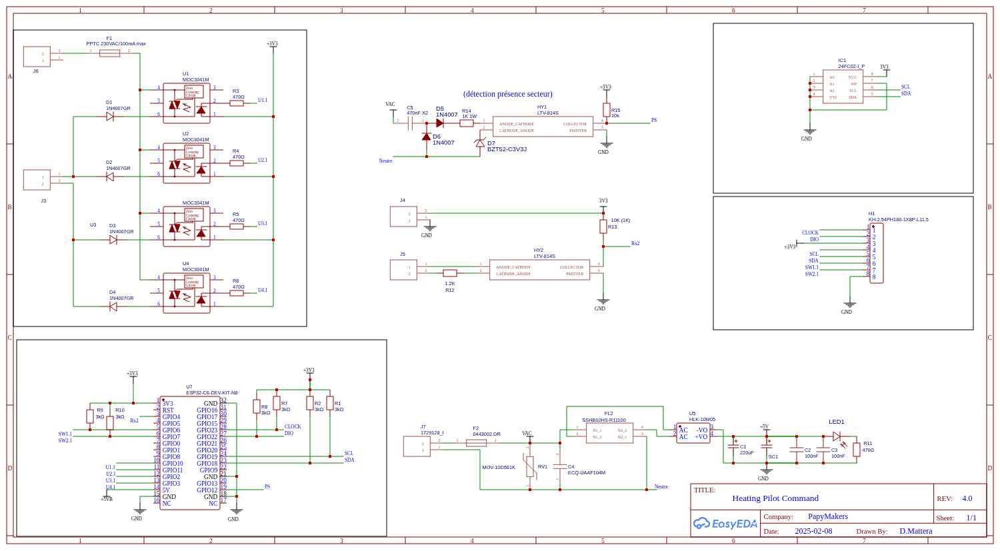
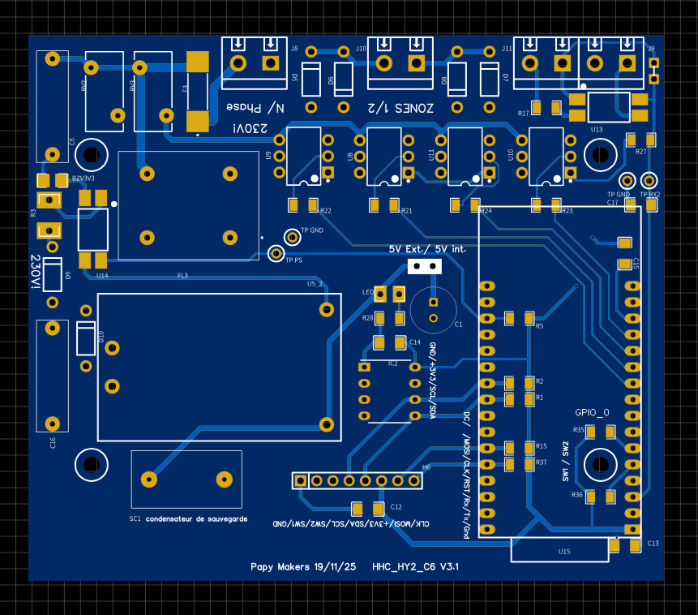

# Gestionnaire de chauffage 2 zones — ESP32 fil pilote + Linky + MQTT

> 🆕 **Nouveau (juillet 2025)** — Le **planificateur hebdomadaire** est désormais
> documenté. Il s'active avec une EEPROM 24C32 en remplacement direct de la 24C02.
> Voir [Planificateur hebdomadaire](#planificateur-hebdomadaire-eeprom-24c32).

Gestionnaire de chauffage électrique à fil pilote pour **2 zones**, basé sur ESP32-C6.  
Contrôle les radiateurs via fil pilote (5 ordres), lecture du compteur Linky, gestion Tempo EDF, interface Web et MQTT.

> **Affichage TM1637** (4 digits 7 segments) — PCB en production.  
> Un kit PCB compagnon (afficheur TM1637 + bargraphe LEDs de statut + switches, en
> boîtier DIN 6 modules) est disponible dans le dépôt
> [`heating-2z-display-board`](https://github.com/Papymakers/heating-2z-display-board).

---

## Fonctionnalités

- Pilotage fil pilote **2 zones** — 5 ordres : STOP, Hors-Gel, ECO, CONFORT, Confort -2°C
- Lecture trame **Linky TIC** (mode historique)
- Gestion **Tempo EDF** — jours Bleu/Blanc/Rouge avec compteurs de saison (rouges/blancs) sauvegardés en EEPROM
- **Délestage automatique** sur dépassement de puissance souscrite
- Interface **Web responsive** embarquée (rafraîchissement par polling HTTP)
- Communication **MQTT** complète (status, commandes, log)
- **Planificateur** hebdomadaire configurable depuis la WebUI *(nécessite une EEPROM 24C32 — voir [note ci-dessous](#planificateur-hebdomadaire-eeprom-24c32))*
- Sauvegarde des états en **EEPROM I2C** (24C02 par défaut, ou 24C32 pour le planificateur)
- Boutons physiques avec gestion multi-clic et appui long
- LED RGB de statut système

---

## Architecture matérielle

### Composants

| Composant | Référence | Rôle |
|-----------|-----------|------|
| Microcontrôleur | ESP32-C6-DevKitC-1-N8 | CPU WiFi/MQTT/Web |
| Afficheur | TM1637 4 digits | Affichage zone/mode |
| EEPROM | 24C02 (I2C, 0x50) | Persistance des états |
| Optocoupleurs | 2× MOC3041 par zone | Commande fil pilote 230V |
| Alimentation | 5V/USB ou régulateur | Alimentation carte |

### Brochage ESP32-C6

| Fonction | GPIO |
|----------|------|
| Zone 1 — MOC positif | GPIO 3 |
| Zone 1 — MOC négatif | GPIO 2 |
| Zone 2 — MOC positif | GPIO 11 |
| Zone 2 — MOC négatif | GPIO 10 |
| Switch sélection zone | GPIO 7 |
| Switch changement mode | GPIO 6 |
| Linky RX (TIC) | GPIO 4 |
| TM1637 CLK | GPIO 23 |
| TM1637 DIO | GPIO 22 |
| I2C SDA (EEPROM) | GPIO 18 |
| I2C SCL (EEPROM) | GPIO 19 |
| LED RGB | GPIO 8 |
| Bouton BOOT | GPIO 9 |

### Principe de commande fil pilote (MOC3041, actif bas)

| Ordre | MOC+ | MOC− |
|-------|------|------|
| STOP | LOW | HIGH |
| Hors-Gel | HIGH | LOW |
| ECO | LOW | LOW |
| CONFORT | HIGH | HIGH |
| CM2 | cycle 7s/293s | — |

### Schéma et carte

Schéma électronique de la carte principale :



Carte principale assemblée :



---

## Installation

### Prérequis

- [PlatformIO](https://platformio.org/) (VS Code ou CLI)
- ESP32-C6-DevKitC-1 avec 8 MB Flash

### Configuration

Copier et adapter `include/config.h` :

```cpp
// Réseau WiFi
inline constexpr char WIFI_SSID[]     = "YOUR_SSID";
inline constexpr char WIFI_PASSWORD[] = "YOUR_PASSWORD";

// IP fixe (adapter à votre réseau)
inline const IPAddress LOCAL_IP (192, 168, 1, 50);
inline const IPAddress GATEWAY  (192, 168, 1, 1);

// Broker MQTT
inline constexpr char MQTT_BROKER[] = "192.168.1.x";
```

Choisir le type d'EEPROM dans `config.h` :

```cpp
#define EEPROM_TYPE_24C02   // 256 octets (défaut) — sans planificateur
// #define EEPROM_TYPE_24C32   // 4KB — active le planificateur hebdomadaire
```

> **24C02 (256 octets)** — suffisant pour la persistance des états de zones, des
> réglages Tempo et du délestage. Le **planificateur hebdomadaire est désactivé**
> (pas assez de mémoire pour stocker les profils horaires).
>
> **24C32 (4 Ko)** — active le planificateur hebdomadaire. Remplacement **pin-to-pin
> direct** de la 24C02 (même boîtier 8 broches, même adresse I2C 0x50, A0/A1/A2 à GND).
> Référence testée : **Microchip AT24C32E** (boîtier PDIP-8 : `AT24C32E-PUM`).
> Après remplacement de la puce et bascule du `#define`, effacer l'EEPROM au premier
> démarrage (bouton BOOT maintenu, ou depuis la page web) pour initialiser le nouveau
> plan mémoire.

### Compilation et upload

```bash
pio run --target upload
pio device monitor
```

---

## Interface Web

Accéder via `http://<LOCAL_IP>` depuis le réseau local.

- Contrôle manuel de chaque zone
- Visualisation de la puissance instantanée en temps réel
- Période Tempo du jour (Bleu/Blanc/Rouge)
- Compteurs de jours Tempo consommés sur la saison (rouges/blancs)
- Réglages du délestage automatique
- Planificateur hebdomadaire *(visible uniquement avec une EEPROM 24C32)*

<!-- Capture d'écran à ajouter :  -->

### Planificateur hebdomadaire (EEPROM 24C32)

La section **Calendrier de chauffage** de la page web n'apparaît que si le firmware
détecte une EEPROM 24C32. Avec une 24C02, cette section est automatiquement masquée.

Le planificateur repose sur des **profils réutilisables** : chaque profil définit une
journée complète en tranches de 30 minutes (48 créneaux), auxquelles on affecte un ordre
(STOP / HG / ECO / CONFORT / CM2). On associe ensuite un profil à chaque zone. L'éditeur
web permet de peindre les créneaux à la souris (clic = cycle d'ordre, glisser = remplir)
et de sauvegarder les profils et leurs affectations.

Le planificateur reste **non prioritaire** : une commande manuelle (bouton, web ou MQTT),
un délestage ou une règle Tempo prennent le pas sur l'ordre programmé.

---

## Topics MQTT

### Publication (device → broker)

| Topic | Contenu |
|-------|---------|
| `heatingCtrl_v4/status` | JSON état complet du système |
| `heatingCtrl_v4/zone/N/mode` | Mode actuel de la zone N |
| `heatingCtrl_v4/tempo` | Période Tempo courante |
| `heatingCtrl_v4/linky` | Données Linky (PAPP, PTEC…) |
| `heatingCtrl_v4/log` | Messages de log |

### Souscription (broker → device)

| Topic | Payload | Action |
|-------|---------|--------|
| `heatingCtrl_v4/zone/N/cmd` | `STOP` `HG` `ECO` `CONF` `CM2` | Commande zone N |

---

## Structure du projet

```
esp32-heating-2z/
├── include/
│   ├── config.h          # Configuration (pins, réseau, timings)
│   └── types.h           # Types et structures partagés
├── src/
│   └── main.cpp          # Orchestrateur principal + FSM système
├── lib/
│   ├── ZoneManager/      # Gestion des zones de chauffage
│   ├── CommandHandler/   # Traitement des commandes MQTT/Web
│   ├── LinkyReader/      # Décodage trame TIC Linky
│   ├── TempoManager/     # Gestion périodes Tempo EDF
│   ├── OverloadManager/  # Délestage automatique
│   ├── ScheduleManager/  # Planificateur hebdomadaire
│   ├── DisplayManager/   # Affichage TM1637
│   ├── StorageManager/   # EEPROM I2C (24C02/24C32)
│   ├── Publisher/        # Publication MQTT
│   ├── WebUI/            # Interface Web + serveur HTTP
│   └── ErriezTM1637/     # Pilote afficheur TM1637 (copie locale, MIT)
├── index.html            # WebUI (embarquée dans le firmware)
├── partitions.csv        # Table de partitions 8MB Flash
├── platformio.ini        # Configuration PlatformIO
├── CHANGELOG.md
└── LICENSE
```

---

## Dépendances

```ini
lib_deps =
    knolleary/PubSubClient @ ^2.8
    bblanchon/ArduinoJson @ ^7.0.0
```

La bibliothèque **ErriezTM1637** (pilotage de l'afficheur) n'est **pas** déclarée dans
`lib_deps` : elle est fournie en **copie locale** dans le dossier `lib/ErriezTM1637/`
(licence MIT, source : <https://github.com/Erriez/ErriezTM1637>). PlatformIO la compile
directement, sans téléchargement.

> ⚠️ **Problème de chargement possible avec VS Code / PlatformIO**
>
> Selon les versions, PlatformIO ne résout plus la bibliothèque depuis le registre
> sous l'identifiant `erriez/ErriezTM1637` : le chargement des dépendances échoue, ou
> une autre bibliothèque `TM1637` entre en conflit (erreurs de compilation dans
> `DisplayManager` : constructeur, `begin()`, `writeData`).
>
> **Solution :** la bibliothèque est déjà embarquée dans `lib/ErriezTM1637/` — il n'y a
> donc rien à installer. Si vous aviez tenté d'ajouter une autre bibliothèque TM1637
> pendant vos essais, purgez le cache des dépendances puis recompilez :
>
> ```bash
> rm -rf .pio/libdeps        # Windows : rmdir /s /q .pio\libdeps
> pio run
> ```
>
> PlatformIO ne re-résout alors que `PubSubClient` et `ArduinoJson`, plus la copie
> locale d'ErriezTM1637 — sans aucun conflit.

---

## Licence

MIT — voir [LICENSE](LICENSE)

## Auteur

Denis Mattera — 2025

---

## Hardware

Le schéma et une vue de la carte principale sont fournis dans le dossier `hardware/`
à titre de référence. Les fichiers de fabrication complets (Gerbers, BOM) ne sont pas
publiés dans ce dépôt.

```
hardware/
├── hardware_README.md                    # Notes de fabrication
└── main-board/
    ├── schematic_main_board.png          # Schéma électronique
    └── Heating-Control_main-board.jpeg   # Vue de la carte
```

Le schéma permet de reproduire ou d'adapter la carte. Pour obtenir un PCB prêt à
l'emploi, voir la section [Commander des cartes](#commander-des-cartes).

---

## Commander des cartes

Ce projet représente 4 ans de développement, de prototypage et de tests en conditions réelles. Le firmware est open source — si vous souhaitez soutenir le projet ou gagner du temps, les cartes sont disponibles à la commande.

| Option | Contenu | Prix indicatif |
|--------|---------|----------------|
| **PCB nu** | Carte principale | 15€ |
| **Kit d'affichage** | 3 PCB (façade + TM1637/bargraphe + liaison/switches), boîtier DIN 6 modules — voir [`heating-2z-display-board`](https://github.com/Papymakers/heating-2z-display-board) | 15€ |

*Frais de port inclus. Expédition depuis la France.*

📧 Commandes et questions : **support@papymakers.com** - https://papymakers.com/

---

## Contact & Support

- **Bug / question technique** → ouvrir une [Issue](../../issues)
- **Commandes** → support@papymakers.com
- **Discussions générales** → onglet [Discussions](../../discussions)
